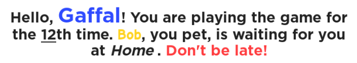

# RichText

I've made this for personal use, but here is the basic usage.

This module helps to keep RichText organized.

<br>

# Basic Usage

```lua
local RichText = require(<path to RichText>)

local MyText = RichText.new(initial_text: string | nil)
local Final = MyText:Get() -- or MyText.Text
```

## Basic Style

```lua
local text = RichText.new("When the sun's out")

text:Bold() -- affects the whole string if the target is not specified
text:Get() -- <b>When the sun's out<b/>


local text = RichText.new("When the sun's out")

text:Bold('sun') -- affects only a specific part
text:Get() -- When the <b>sun</b> is out

-- Methods
text:Bold(target: string | nil) -- <b></b>
text:Italic(target: string | nil) -- <i></i>
text:Underline(target: string | nil) -- <u></u>
text:Strike(target: string | nil) -- <s></s>
```

**Multiple Styles**

```lua
local text = RichText.new("Flying high like the birds and the bees.")

text:Bold('Flying') -- <b>Flying</b> high like the birds and the bees.
:Italic('high') -- <b>Flying</b> <i>high</i> like the birds and the bees
:Strike('Flying') -- <b><s>Flying</s></b> <i>high</i> like the birds and the bees
:Underline() -- <u><b><s>Flying</s></b> <i>high</i> like the birds and the bees.</u>
```

**Result:**
<br>


<br>

# Color, Size and Font

**Methods**
```lua
-- affects the whole string if the target is not specified


RichText:ColorRGB(r: number, g: number, b: number, target: string | nil) || RichText:ColorRGB(Color3.fromRGB(r, g, b), target: string | nil)
RichText:Size(fontSize: number, target: string | nil)
RichText:Font(font: Enum.Font | string, target: string | nil)
```

**Example**
```lua
local text = RichText.new('I should just walk away')

text:ColorRGB(128, 20, 223, 'should') -- I <font color="rgb(128, 20, 223)">should</font> just walk away
text:Size(30, 'just') -- I <font color="rgb(128, 20, 223)">should</font> <font size="30">just</font> walk away
text:Font(Enum.Font.GothamBold, 'walk') -- I <font color="rgb(128, 20, 223)">should</font> <font size="30">just</font> <font face="GothamBold">walk</font> away
```

**Result:**
<br>


<br>

# Format

This is only useful when `string.format` turns into a mess.

Wrap your replacement with `${x}`, pretty much like template strings in JavaScript.

```lua
local text = RichText.new()

local replacement = {
	name = 'max',
	age = 50,
}

text.Text = 'Hello! My name is ${name} and I am ${age} years old.'
text:Format(replacement)

text:Get() -- Hello! My name is max and I am 50 years old.
```

## Other methods
```lua
RichText:Wrap(target: string | nil, before: string, after: string)
RichText:Break(target: string | nil)
RichText:InsertAfter(target: string, text: string)
RichText:Join(join: string | RichText)
```

**Example**
```lua
local text = RichText.new('Wrap, Break, InsertAfter')

text:Wrap('Wrap', 'before-', '-after') -- before-Wrap-after, Break, InsertAfter
text:Break('Break') -- before-Wrap-after, Break<br />, InsertAfter
text:InsertAfter('After', '>>>') -- before-Wrap-after, Break<br />, InsertAfter>>>

text:Join(', join') -- before-Wrap-after, Break<br />, InsertAfter>>>, join
text:Join(RichText.new(', RichTextJoin'):Bold('RichTextJoin')) -- before-Wrap-after, Break<br />, InsertAfter>>>, join, <b>RichTextJoin</b>
```

<br>

# Final Example
```lua
local RichText = require(<path to RichText>)

local PlayerData = {
	playerName = 'Gaffal',
	petName = 'Bob',
	petLocation = 'Home',
	logins = 12,
}

local text = RichText.new(
	'Hello, ${playerName}! You are playing the game for the ${logins}th time. ${petName}, you pet, is waiting for you at ${petLocation}. Don\'t be late!'
)
:Format(PlayerData)
:Bold(PlayerData.playerName)
:Bold(PlayerData.petName)
:Italic(PlayerData.petLocation)
:Underline(tostring(PlayerData.logins))
:Font(Enum.Font.GothamBold)
:Font('Cartoon', PlayerData.petName)
:ColorRGB(255, 61, 64, "Don't be late!")
:ColorRGB(Color3.fromRGB(47, 75, 255), PlayerData.playerName)
:ColorRGB(Color3.fromRGB(255, 211, 35), PlayerData.petName)
:Size(20, PlayerData.playerName)
```

**Result:**
<br>


```<font face="GothamBold">Hello, <b><font color="rgb(47,75,255)"><font size="20">Gaffal</font></font></b>! You are playing the game for the <u>12</u>th time. <b><font face="Cartoon"><font color="rgb(255,211,35)">Bob</font></font></b>, you pet, is waiting for you at <i>Home</i>. <font color="rgb(255,61,64)">Don't be late!</font></font>```


**Achieving the same result using raw text**

```lua
local PlayerData = {
	playerName = 'Gaffal',
	petName = 'Bob',
	petLocation = 'Home',
	logins = 12,
}

local text = ([[<font face="GothamBold">Hello, <b><font color="rgb(47,75,255)"><font size="20">%s</font></font></b>! You are playing the game for the <u>%s</u>th time. <b><font face="Cartoon"><font color="rgb(255,211,35)">%s</font></font></b>, you pet, is waiting for you at <i>%s</i>. <font color="rgb(255,61,64)">Don't be late!</font></font>]])
:format(PlayerData.playerName, PlayerData.logins, PlayerData.petName, PlayerData.petLocation)

-- (complete mess)
```
